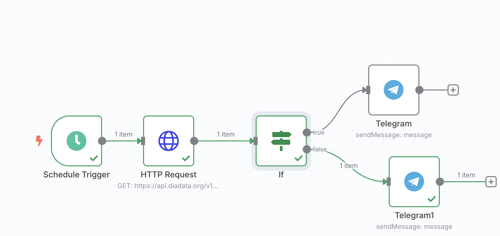
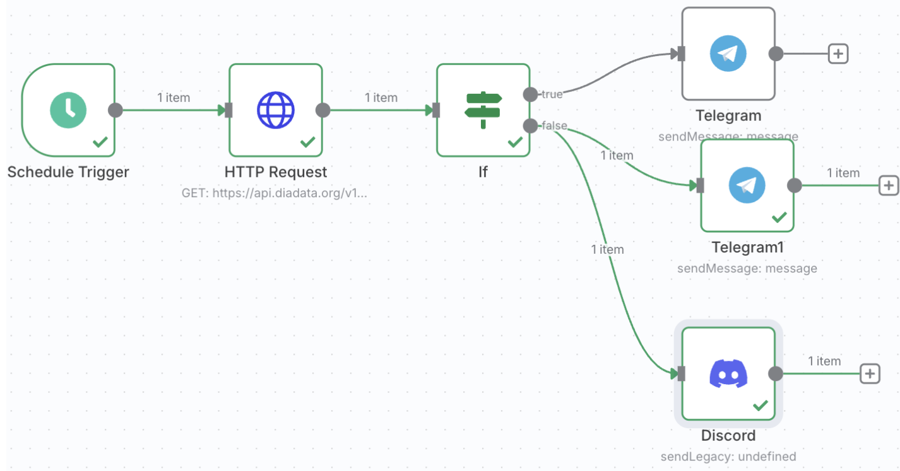
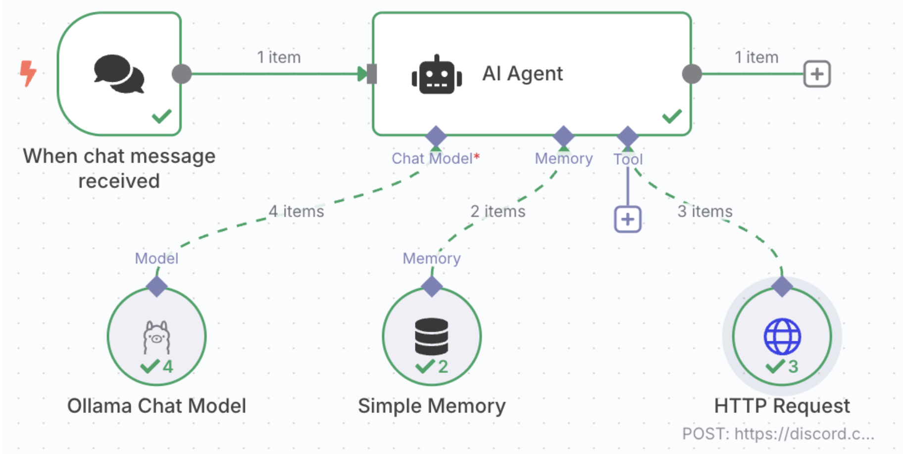

# n8n workflows
n8n: An Open-Source Low-Code/No-Code Workflow Automation Tool.

### Install Docker
1- Use the link below and install Docker based on your ios:[https://docs.docker.com/get-started/get-docker/](https://docs.docker.com/get-started/get-docker/) <br>
2- Open a terminal and test your docker installation: <br>
 ``` bash
docker run hello-world
docker –version
```
### Docker install n8n 
Free installation of n8n on your machine, via docker using the link provided [https://docs.n8n.io/hosting/installation/docker/](https://docs.n8n.io/hosting/installation/docker/)
The best is to use the commands below. So, although n8n is on docker, Ollama running on the machine can be recognizable: <br>
```bash
docker volume create n8n_data

docker run -it --rm \
  --name n8n \
  --add-host=host.docker.internal:host-gateway \
  -p 5678:5678 \
  -v ~/.n8n:/home/node/.n8n \
  n8nio/n8n
```
### WorkFlow1: my_workflow_telegram
**my_workflow_telegram.json** is the workflow for sending DogeCoin price, every minute, to telegram using telegram bot token.<br>

To build this work flow:<br>
- In **Http request module** use **GET**  and the  **API key**, for Dogecoin price, from [this link](https://www.diadata.org/app/price/asset/Dogechain/0x0000000000000000000000000000000000000000/) <br>
- In **Telegram Module** you need **Token** and **Chat ID**, follow the below steps to get them:
-  Have a chat with **@BotFather** to get your token:<br>
> create a new bot: */newbot* <br>
> name your bot: *yourname stream test* <br>
> username for your bot: *yournamestreambot* <br>
> you will get token <br>
-  To get Chat ID follow the below steps:
> Create a test channel in telegram and send a message (e.g. hello) there <br>
> Add *yournamestreambot* as an administrator in your  test channel <br>
> Forward the hello message to **@get_id_bot**, so you will get Chat ID <br>

### WorkFlow2: my_workflow_telegram_discord
In **my_workflow_telegram_discord.json** message will also be send to a discord channel.
 <br>
- In **Discord Module** you can use the **Webhook** you created in your discord app following the below steps: <br>
> Create a new server in your discord app <br>
> Create a new channel in your server <br>
> Go to Edit channel and select integration <br>
> Create webhook <br>
> Copy webhook URL and use it in credential setting of Discord in n8n workflow<br>

### WorkFlow3: my_workflow_ai_agent
The third workflow is **my_workflow_ai_agent.json** that uses **ollama** and **llama3.2** as the language model agent and via an http request and Webhook sends message to Discord. <br>
 <br>

- Install locally Ollma on your machine: [https://ollama.com/download](https://ollama.com/download) <br>

- Pull an Ollma model such as llama3.2 (a large language model) by running the following in the terminal.
```bash
  ollama pull llama3.2
```
- setup Ollama chat model Credential to connect: <br>
> Base URL: **http://host.docker.internal:11434** <br>
> Model:   **llama3.2** <br>
-  HTTP Request Node Settings: <br>
> Method: **POST** <br>
> URL: **your Discord webhook URL** <br>
> **Send Body 🟢** <br>
> Body content Type: **Raw** <br>
> Content Type: **application/json** <br>
> Body: <br>
```bash
{
 "content": "{{$fromAI('content')}}"
}
```


